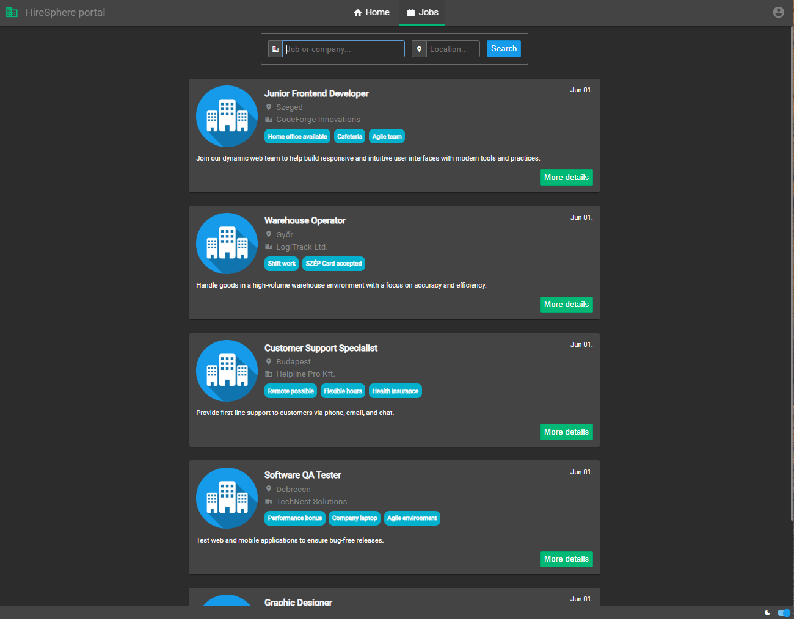
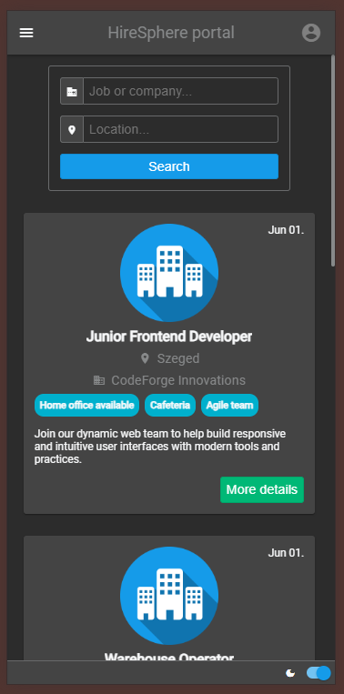

# HireSphere Portal (Kibit Home Assignment)
[](https://ci.appveyor.com/project/Sholtee/hiresphere/branch/main)


## Prerequisites
- Node.js v22.12.0+
- npm

## Folder structure
```
root
│
└───artifacts [test ouputs]
│
└───docs [related documents]
│
└───fake-api [Fake-API implementation]
│
└───public [static assets that are served as-is (not processed by Vite)]
│   │
│   └───resources [i18n]
│
└───scripts [Vite plugins]
│
└───src [sources root]
│   │
│   └───assets [assets that might be embedded]
│   │
│   └───components [Vue components]
│   │   │
│   │   └───views [pages of the app]
│   │   │
│   │   └───widgets [generic components]
│   │
│   └───scripts [non component-specific JS files]
│   │
│   └───styles [non component-specific SASS styles]
│
└───tests [E2E tests]
```

## Setting up the environment
- install [Node.js](https://nodejs.org/dist/v22.12.0/node-v22.12.0-x64.msi )
- `npm install` (this will install the fake API dependencies as well)

## Adding custom test data
- delete the `./fake-api/fakeapi.db` file if exists
- edit the [test-data.sql](https://github.com/Sholtee/hiresphere/blob/main/fake-api/test-data.sql)
- start the debug server

## Running the debug server
- `npm run serve` (this will execute the linter checks as well as starts the fake API)

### Features implemented
- landing page
- job search
- job detailer
- log in (as an employer), log out
- dark mode
- slide show for highlighted jobs
- endless scrolling (there is no pager, new posts are loaded as you scrolling down)
- mobile view
- fake backend (for testing)

## Log in as an employer
- use `test@employer[1|2|3].hu` as username
- password can be anything

## Running the E2E tests
- `npm run cypress:open` (this will start the fake API and feeds [Cypress](https://www.cypress.io/) with the **production** assets)

## Screenshots

